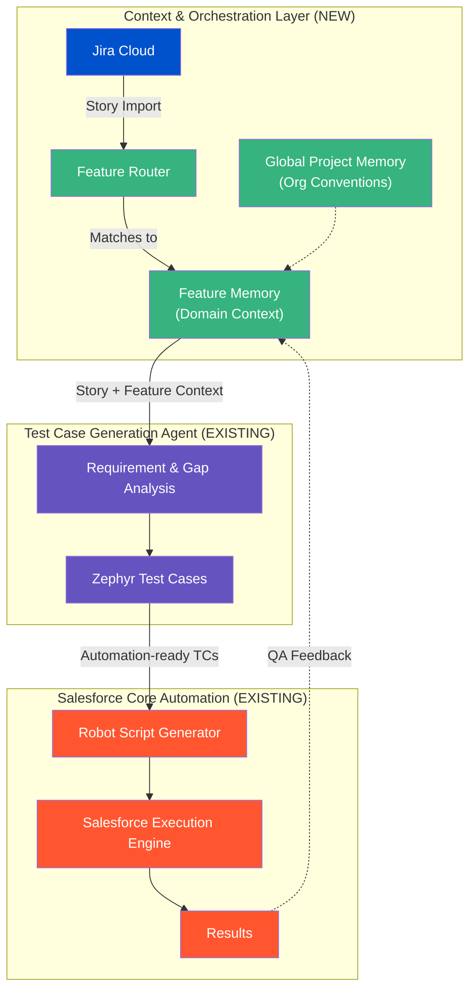

Implementation Plan

This plan re-evaluates the "Salesforce QA Helper" based on the clarified product architecture. The new system is NOT a replacement for the existing agents; it is a **Context + Orchestration Layer** that sits above them.

## 1. Corrected Product Architecture

## 2. Responsibility of Each System

### Test Case Generation Agent (Existing)
*   **Owns:** QA prompt templates, requirement analysis, gap identification, Zephyr test case schema, anti-hallucination rules, Jira test-case write-back.
*   **Does NOT own:** Fetching the initial Jira context, maintaining long-term cross-story feature memory.

### Salesforce Automation Agent (Existing)
*   **Owns:** LLM → Robot Framework translation, `GlobalKeywords.robot`, keyword catalog generation, script validation loop, Salesforce execution, results generation.
*   **Does NOT own:** Understanding Jira stories or QA requirements.

### Context/Orchestration Layer (New)
*   **Owns:** Connecting to Jira, importing stories, grouping stories into Features (Domains), maintaining **Feature Memory** (persistent context), and routing the right context payload to the existing agents.
*   **Does NOT own:** Generating test cases or writing Robot scripts.

## 3. Integration Points

1.  **Jira → Context Layer:**
    *   *Payload:* Raw Jira Story (Description, AC, Comments, Epic link).
2.  **Context Layer → Test Case Agent:**
    *   *Payload:* `Story Context` + `Feature Memory` (business rules, edge cases) + `Project Memory` (global QA conventions).
    *   *Interface:* API call or shared file context (depending on how the Test Case agent is exposed).
3.  **Test Case Agent → Context Layer:**
    *   *Payload:* Structured Test Cases (Zephyr schema) + Requirement Analysis notes.
    *   *Action:* Context layer updates Feature Memory based on new learnings from the analysis.
4.  **Context Layer → Automation Agent:**
    *   *Payload:* Automation-ready Test Cases (Summary, Steps, Expected Results).
5.  **Automation Agent → Context Layer:**
    *   *Payload:* Execution Results (Pass/Fail, Logs).

## 4. Feature Memory Design

To avoid duplicating the existing "Project Memory" in the Test Case Agent, we define a clear hierarchy:

*   **Project Memory (Global):** Org-wide standards. (e.g., "Always test on Chrome", "Never use hardcoded IDs", "Salesforce Core conventions").
*   **Feature Memory (Domain-specific):** Persistent context for a specific functional area (e.g., "Campaign Management"). Contains:
    *   Known business rules (e.g., "Campaigns cannot be deleted if active").
    *   Relevant Salesforce objects/fields (e.g., `Campaign.Status`, `CampaignMember`).
    *   Known edge cases and past bug learnings.
*   **Story Context (Ephemeral):** The specific AC and details of the current ticket being worked on.

**Workflow:** When a new story is analyzed, the AI merges the `Story Context` with the existing `Feature Memory` and `Project Memory` to feed the Test Case Agent. If the analysis reveals a new business rule, the Context Layer updates the `Feature Memory` for future stories.

## 5. Current Plan Gap Analysis

Based on the previous (incorrect) implementation plan:

*   **UNNECESSARY / DUPLICATE:** Porting the Jira integration logic (`jira_client.py`), QA prompt templates, and Zephyr schemas into the new project. The Test Case Agent already has these.
*   **UNNECESSARY / DUPLICATE:** Porting `run_tests.py` or Robot generation logic. The Automation Agent already handles this.
*   **MISSING (Required):** The Feature Memory architecture. The logic to group stories by Feature and maintain that persistent context file/database.
*   **MISSING (Required):** The orchestration API/CLI. A way to trigger the workflow: `jira story -> feature memory -> test case agent -> automation agent`.

## 6. Recommended Implementation Sequence

**Step 1: Context Layer Foundation (Jira + Feature Memory)**
*   Implement Jira connection/search.
*   Implement Story import and automatic association with a Feature (Domain).
*   Create the initial Feature Memory structure (saving context to local files/DB).

**Step 2: Integration with Test Case Agent**
*   Define the interface to pass `Story + Feature Memory + Project Memory` to the existing Test Case Agent.
*   Execute Requirement Analysis and Test Case Generation via the existing agent.
*   Capture the output and save the generated test cases locally.

**Step 3: Feature Memory Update Loop**
*   Implement the logic to update Feature Memory based on the outputs/learnings from Step 2.

**Step 4: Integration with Automation Agent (Future Phase)**
*   Define the interface to pass the generated test cases to the existing Salesforce Automation Agent.
*   Trigger Robot script generation and execution.

## 7. Reuse vs Rebuild

| Capability | Existing Project | Reuse / Modify / Rebuild | Reason |
| :--- | :--- | :--- | :--- |
| Jira Connection/Import | Test Case Agent | **Modify/Extract** | Need to decouple it from the React UI so the Context Layer can drive it programmatically. |
| QA Prompt Templates | Test Case Agent | **Reuse** | Already highly optimized and battle-tested. |
| Test Case Schema | Test Case Agent | **Reuse** | Zod schemas and Zephyr compatibility already exist. |
| Project/Feature Memory | Test Case Agent | **Modify/Extend** | The existing concept needs to be formalized into the Project vs. Feature hierarchy defined above. |
| Robot Script Generation | Automation Agent | **Reuse** | Existing `ai_bridge.py` is complex and fully functional. |
| Keyword Catalog / Guardrails | Automation Agent | **Reuse** | Critical IP; no need to touch. |
| Salesforce Execution Engine | Automation Agent | **Reuse** | Already handles headless/headed runs and credentials. |
| **Workflow Orchestration** | **None** | **Build (New)** | This is the core purpose of the new Context Layer. |
